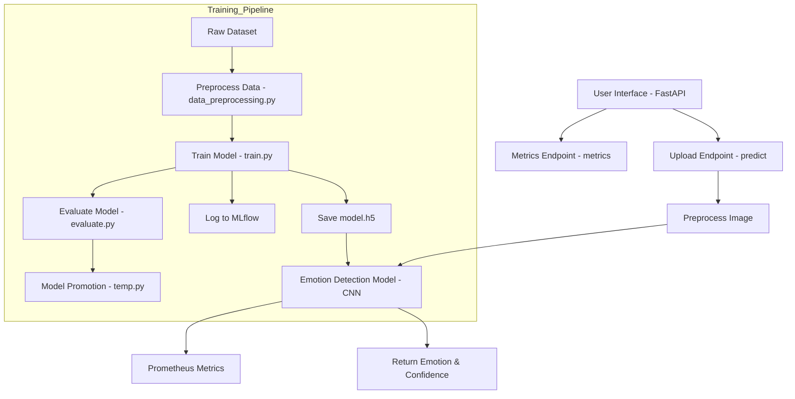
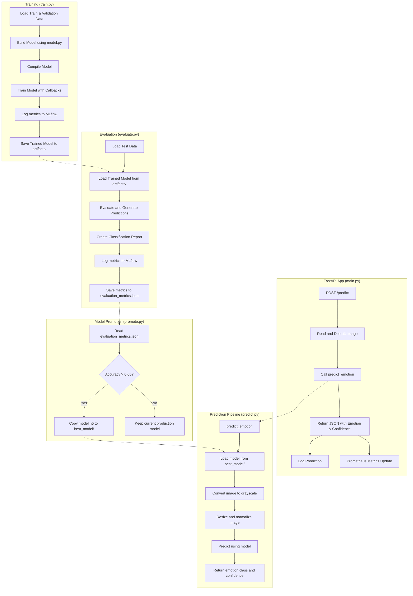

# EmotionLens


## Features

- Data versioning with DVC
- Automated ML pipeline for data preprocessing, model training, and evaluation
- Experiment tracking with MLflow
- Model deployment via FastAPI
- Monitoring with Prometheus and Grafana

## Project Structure

```
EmotionLens/
├── data/               # Data directory (tracked by DVC)
├── src/                # Source code
├── app/                # API application
├── monitoring/         # Monitoring configuration
├── models/             # Model storage
├── notebooks/          # Jupyter notebooks
├── dvc.yaml            # DVC pipeline configuration
├── params.yaml         # Parameters for the pipeline
├── requirements.txt    # Python dependencies
└── Dockerfile          # Container definition
```

## Setup

1. Clone the repository:
```bash
git clone https://github.com/your-username/EmotionLens.git
cd EmotionLens
```

2. Create a virtual environment:
```bash
python -m venv venv
source venv/bin/activate  # On Windows: venv\Scripts\activate
```

3. Install dependencies:
```bash
pip install -r requirements.txt
```

4. Initialize DVC:
```bash
dvc init
```

## Data Structure

Place your emotion dataset in the `data` directory with the following structure:

```
data/
├── train/
│   ├── anger/
│   ├── disgust/
│   ├── fear/
│   ├── happiness/
│   ├── sadness/
│   ├── surprise/
│   └── neutral/
├── test/
└── validation/
```

Each emotion folder should contain facial images displaying that emotion.

## Running the Pipeline

Execute the entire ML pipeline:

```bash
dvc repro
```

This will run:
1. Data preprocessing
2. Model training
3. Model evaluation
4. Deployment of the best model

## Viewing Experiments

Start the MLflow UI:

```bash
mlflow ui
```

Visit http://localhost:5000 to view experiment results.

## Running the API

Start the FastAPI application:

```bash
cd app
uvicorn main:app --reload
```

The API will be available at http://localhost:8000

## Monitoring

1. Start Prometheus:
```bash
docker run -d --name prometheus -p 9090:9090 -v $(pwd)/monitoring/prometheus/prometheus.yml:/etc/prometheus/prometheus.yml prom/prometheus
```

2. Start Grafana:
```bash
docker run -d --name grafana -p 3000:3000 grafana/grafana
```

3. Import the dashboard from `monitoring/grafana/dashboard.json`

Visit http://localhost:3000 to access the Grafana dashboard.

## Using Docker

The entire application is containerized using Docker Compose, which sets up:
- The EmotionLens application
- Prometheus for metrics collection
- Grafana for monitoring dashboards

### Option 1: Quick Start with Docker Compose

1. Run the complete pipeline:
```bash
chmod +x run-pipeline.sh
./run-pipeline.sh
```

This script will:
- Build the Docker image
- Run data preprocessing, model training, and evaluation
- Start all services

2. Access the services:
- EmotionLens API: http://localhost:8000
- Prometheus: http://localhost:9090
- Grafana: http://localhost:3000 (login with admin/admin)

### Option 2: Manual Docker Setup

1. Build and start the services:
```bash
docker-compose build
docker-compose up -d
```

2. Run the ML pipeline:
```bash
docker-compose exec app python src/data_preprocessing.py
docker-compose exec app python src/train.py
docker-compose exec app python src/evaluate.py
```

### Stopping the Application

```bash
docker-compose down
```

### Persisted Data

The following data is persisted through Docker volumes:
- ML models: `./models` directory
- Training data: `./data` directory
- MLflow tracking: `./mlruns` directory
- Prometheus data: Docker volume `prometheus-data`
- Grafana data: Docker volume `grafana-data`

## High level Design (HLD)



## Low Level Design (LLD)

